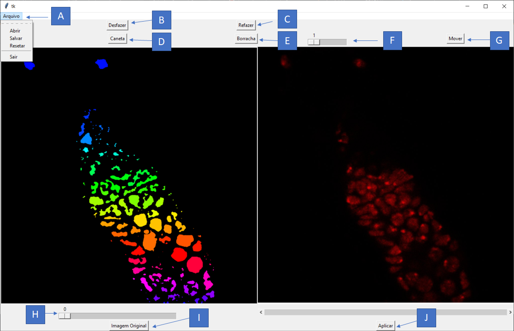

# CellDetectionImage
Interface gráfica feita no TKinter para o usuário selecionar a segmentação ideal de imagens médicas e biológicas, com o 
auxílio de algoritmos bio-inspirados e level sets.

## Execução
- Certifique-se se está instalado a versão 3.6 ou posterior do Pyhton.
- Instale os seguintes pacotes: **TKinter**, **PIL**, **numpy** e **opencv-python**. Isso pode ser feito usando PIP ou 
qualquer outro gerenciador de pacotes do Python.
- Execute o arquivo GUI.py com o comando `python GUI.py` no terminal ou cmd.

## Como Utilizar

 

Ao executar, selecione uma imagem do banco de dados. Espere até o algoritmo ser executado, por usar algoritmo 
bio-inspirado e level set a imagem gerada pode demorar, principalmente se a imagem for muito grande. 

Clique na área que está selecionada errada da imagem da esquerda, com isso aparecerá na imagem da direita o contorno da 
mesma, selecione entre a **caneta** e **borracha** para alterar a área. É possível selecionar o tamanho da ferramenta 
selecionada (borracha ou caneta) usando a escala representada pela letra **F** na imagem. Para ter maior precisão é possível
 dar **zoom** na imagem da direita usando gesto de pinça no trackpad ou o scroll do meio do mouse.  Caso tenha feio algum 
 traço errado é possível **desfazer** ou **refazer** os últimos traços.  
 
Quando a área estiver corrigida, clicar no botão **aplicar** jogar as áreas corrigidas na imagem da esquerda, caso uma área 
se interseccione a outra da imagem da esquerda elas irão se unir. Se a imagem estiver com muito ruído com o scroll **H** é 
possível remover as regiões com áreas de menor tamanho. Quando terminado a segmentação de toda a imagem clicar em 
Arquivo>>**Salvar** e a imagem será salva na mesma pasta que a original, com o nome original concatenado com “PO.png”. Caso 
o usuário queira refazer a seleção a partir da imagem gerada pelo algoritmo desenvolvido, clicar em Arquivo>>**Resetar**.
 